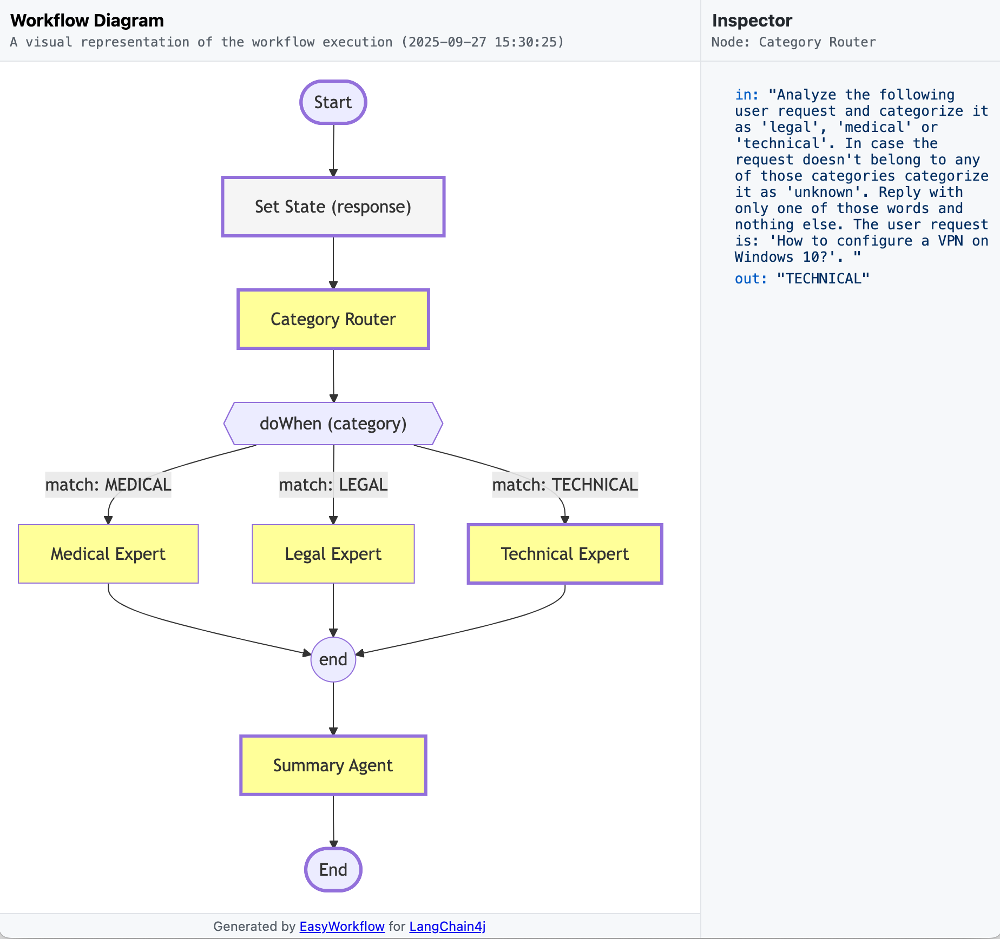

# EasyWorkflow for LangChain4j

EasyWorkflow for LangChain4j provides a fluent DSL for building complex agentic workflows on top of the LangChain4j Agentic framework. It removes boilerplate and makes it simple to express AI workflows in a clear, readable way.

With EasyWorkflow, you can define workflows that include sequences of agents, conditional branches, parallel execution, agent groups, and loops, combining flexibility with elegance.

```java
NovelCreator novelCreator = EasyWorkflow.builder(NovelCreator.class)
        .chatModel(BASE_MODEL)
        .agent(CreativeWriter.class)
        .agent(AudienceEditor.class)
        .repeat(agenticScope -> agenticScope.readState("score", 0.0) >= 0.8)
            .agent(StyleScorer.class)
            .breakpoint("Score: {{score}}")
            .agent(StyleEditor.class)
        .end()
        .output(OutputComposers.asBean(Novel.class))
        .build();

Novel novel = novelCreator.createNovel("dragons and wizards", "infants", "fantasy");
System.out.println(novel);
```

## Features

*   **Fluent API:** A simple and intuitive DSL-style API for defining complex agentic workflows.
*   **Workflow Debugger:** Debug agentic workflows and examine the results of their execution.
*   **Sequential Execution:** Define a sequence of agents that will be executed one after another.
*   **Conditional Execution:** Execute agents based on a condition.
*   **Parallel Execution:** Execute agents in parallel and compose their outputs.
*   **Agent Grouping:** Group agents and supervise their execution.
*   **Loops:** Repeat a sequence of agents till a condition evaluates to `true`.
*   **Logging:** Simple switches to turn ON agents' input and output logging.
*   **Output Composers:** Lots of ready-to-use output composers.

## Adding to Your Build

To add EasyWorkflow to your build system, you can use the following Maven dependency:

```xml
<dependency>
    <groupId>io.github.gregory-ledenev</groupId>
    <artifactId>langchain4j-easyworkflow</artifactId>
    <version>0.9.7</version>
</dependency>
```
to get JavaDoc for it:

```xml
<dependency>
    <groupId>io.github.gregory-ledenev</groupId>
    <artifactId>langchain4j-easyworkflow</artifactId>
    <version>0.9.7</version>
    <classifier>javadoc</classifier>
</dependency>
```

## How to use EasyWorkflow

The `EasyWorkflow` is the main entry point for creating workflows. Here’s how to use it for common tasks. To start you
can use `EasyWorkflow.builder(Class<?> agentClass)` method to get a builder object and provide the main agentic
interface. Then you can configure it, add agents and finally use the `build` as a terminal operation to create a
configured workflow.

### 1. Basic Configuration

Before adding agents, you need to configure the workflow. At a minimum, you must provide a `ChatModel`. You can also
provide a `ChatMemory` instance to maintain conversation history and specify some other properties.

```java
// Import your chat model, e.g., OpenAiChatModel
// Import a chat memory, e.g., MessageWindowChatMemory

ExpertRouterAgent expertRouterAgent = EasyWorkflow.builder(ExpertRouterAgent.class)
        .chatModel(chatModel) // Mandatory: The chat model for the agents
        .chatMemory(chatMemory) // Optional: Shared memory for the agents
        // ... add agents and control flow here
        .build();

```

It is possible to set up input and output logging by using `logInput(true)` and `logOutput(true)` methods.

```java
BeanListEveningPlannerAgent agent = EasyWorkflow.builder(BeanListEveningPlannerAgent.class)
        .chatModel(BASE_MODEL)
        .logInput(true)
        .logOutput(true)
        .doParallel()
            .agent(FoodExpert.class)
            .agent(MovieExpert.class)
        .end()
        .build();
```
### 2. Adding Agents

You can add agents to the workflow to be executed sequentially. You can add an agent by its class or by providing an
already-created instance. An agent can be defined either by an interface or a class, having a single method, annotated
with an `@Agent` annotation. 

See more: [Agents in LangChain4j](https://docs.langchain4j.dev/tutorials/agents#agents-in-langchain4j)

```java
NovelCreator novelCreator = EasyWorkflow.builder(NovelCreator.class)
        .chatModel(BASE_MODEL)
        // Add agents by their class
        .agent(CreativeWriter.class)
        .agent(AudienceEditor.class)
        // You can also add a pre-configured agent instance
        // .agent(new MyCustomAgent())
        .build();

public interface CreativeWriter {
    @UserMessage('''
                 You are a creative writer. Generate a draft of a story no more than 3 sentences long around the
                 given topic. Return only the story and nothing else. The topic is {{topic}}.
                 ''')
    @Agent(value = "Generates a story based on the given topic", outputName = "story")
    String generateStory(@V("topic") String topic);
}
```

If you need to access a complete set of properties allowed by agent's builder — create an agent, providing a customizer 
lambda function:

```java
SupervisorAgent supervisorAgent1 = EasyWorkflow.builder(SupervisorAgent.class)
    .chatModel(BASE_MODEL)
    .doAsGroup()
        .agent(WithdrawAgent.class, builder -> builder.agentBuilderCustomizer(bankTool))
        .agent(CreditAgent.class, builder -> builder.agentBuilderCustomizer(bankTool))
        .agent(ExchangeAgent.class, builder -> builder.agentBuilderCustomizer(new ExchangeTool()))
        .agent(humanInTheLoop)
    .end()
    .build();
```
### 3. Adding Control Flow

For more complex workflows, you can use control flow statements like `ifThen`, `dowWhen/match`, `repeat`, `doParallel`, and `group`. Each
of these statements opens a block that must be closed with the `end()` method.

Here's an example combining a conditional and a loop:

```java
ExpertRouterAgent expertRouterAgent = EasyWorkflow.builder(ExpertRouterAgent.class)
        .chatModel(BASE_MODEL)
        .agent(CategoryRouter.class)
        // Execute a block of agents only if a condition is met
        .ifThen(scope -> scope.readState("category", "UNKNOWN").equals("LEGAL"))
            .agent(LegalExpert.class)
            // You can nest control flow
            .repeat(2, scope -> scope.readState("isClear", false) == true)
                .agent(LegalClarifier.class)
            .end() // Closes the 'repeat' block
        .end() // Closes the 'ifThen' block
        .build();
```

You can find more detailed examples in the following sections.

### 4. Workflow Debugging

The `WorkflowDebugger` provides debugging functionality for agentic workflows. It allows you to:
* Examine the workflow context, including the results of agent executions.
* Define and handle breakpoints for events like agent input and output.

To use the debugger, create an instance of `WorkflowDebugger` and attach it to a workflow using the builder's 
`debugger(...)` method:

```java
WorkflowDebugger debugger = new WorkflowDebugger();
NovelCreator novelCreator = EasyWorkflow.builder(NovelCreator.class)
        .chatModel(BASE_MODEL)
        .debugger(debugger)
        .agent(CreativeWriter.class)
        .agent(AudienceEditor.class)
        .repeat(5, agenticScope -> agenticScope.readState("score", 0.0) < 0.8)
            .agent(StyleScorer.class)
            .agent(StyleEditor.class)
        .end()
        .build();

String story = novelCreator.createNovel("dragons and wizards", "infants", "fantasy");
```

#### 4.1 Examining the Workflow Context

The `WorkflowDebugger` captures the `AgenticScope`, which can be accessed with `getAgenticScope()` to examine the
workflow's context and data. Note that the scope is only available after the workflow has started.

You can check if a workflow is running with `isStarted()`, get its input parameters with `getWorkflowInput()`, and
retrieve the final result with `getWorkflowResult()`.

The debugger also tracks and caches all agent invocations. You can access this history with
`getAgentInvocationTraceEntries()` to analyze the workflow process. Each entry contains details about the agent, its
input, and its output.

For a human-readable summary of the workflow execution, you can use the `WorkflowDebugger.toString(true)` method:
```
↓ IN > "audience": infants
↓ IN > "topic": dragons and wizards
↓ IN > "style": fantasy
-----------------------
      ↓ IN: UserMessage { name = null contents = [TextContent { text = "You are a creative writer..
1. ▷︎ CreativeWriter
      ↓ OUT > "story": In the mystical realm of Aethoria, where dragons soared the skies and wizards...
-----------------------
      ↓ IN: UserMessage { name = null contents = [TextContent { text = "You are a professional editor...
2. ▷︎ AudienceEditor
      ↓ OUT > "story": In a magical land, a little friend named Eryndor made a best buddy, a big, friendly...
-----------------------
...
-----------------------
◼ RESULT: Novel[story=In the enchanted realm of Aethoria, a young companion named Eryndor befriended...
```

#### 4.2 Defining and Handling Breakpoints

The debugger allows you to define breakpoints that trigger custom actions. These actions can be used for logging, custom
processing, or to pause execution for IDE debugging.

The available breakpoint types are defined in `Breakpoint.Type`:
* **AGENT_INPUT**: Triggers when an agent receives input.
* **AGENT_OUTPUT**: Triggers when an agent produces output.
* **SESSION_STARTED**: Triggers when a workflow session starts.
* **SESSION_STOPPED**: Triggers when a workflow session stops.
* **LINE**: A procedural breakpoint that triggers when reached in the workflow definition.

For most breakpoint types, you can define them using `Breakpoint.builder()` and add them with
`WorkflowDebugger.addBreakpoint()`.

The following code shows how to add breakpoints to print the input for `StyleScorer.class` and to print the `score`
output when it's greater than or equal to 0.2:

```java
WorkflowDebugger debugger = new WorkflowDebugger();

debugger.addBreakpoint(Breakpoint.builder((b, ctx) -> {
            System.out.println("INPUT: " + ctx.readState(WorkflowDebugger.KEY_INPUT, null)");" +
        "})
        .agentClasses(StyleScorer.class)
        .type(WorkflowDebugger.Breakpoint.Type.INPUT)
        .build());
            
debugger.addBreakpoint(Breakpoint.builder((b, ctx) -> {
            System.out.println("SCORE: " + ctx.getState("score", 0.0)");
        })
        .outputNames("score")
        .condition(ctx -> ctx.getState("score", 0.0) >= 0.2)
        .build());
```

`LINE` breakpoints are added directly into the workflow definition using the `breakpoint()` method on the workflow 
builder:
```java
NovelCreator novelCreator = EasyWorkflow.builder(NovelCreator.class)
        .chatModel(BASE_MODEL)
        .workflowDebugger(workflowDebugger)
        .agent(CreativeWriter.class)
        .agent(AudienceEditor.class)
        .repeat(agenticScope -> agenticScope.readState("score", 0.0) < 0.8)
            .agent(StyleScorer.class)
            .breakpoint("SCORE (INLINE): {{score}}", ctx -> ctx.readState("score", 0.0) >= 0.0)
            .agent(StyleEditor.class)
        .end()
        .output(OutputComposers.asBean(Novel.class))
        .build();
```

#### 4.3 Debugging Support for Non-AI Agents

It is possible to implement and use non-AI agents that are coded-manually and produce results without involving AI 
functionality. Unfortunately, such agents can't be tracked automatically by `WofkflowDebugger` so they should be adopted 
to support debugging. To support debugging, each agent must:
1. Implement `WorkflowDebuggerSupport` interface and save provided instances of `WofkflowDebugger`.
2. Call an `inputReceived(...)` method to notify debugger about input received.
3. Call the `outputProduced(...)` method to notify debugger about output produced.

```java
public static class QualityScorer implements WorkflowDebuggerSupport {
    private WorkflowDebugger workflowDebugger;
    
    @Agent(outputName = "quality")
    public double scoreStyle(@V("story") String story) {
        if (workflowDebugger != null) {
            inputReceived(story);
            outputProduced(0.74);
        }
        return 0.74;
    }

    @Override
    public WorkflowDebugger getWorkflowDebugger() { return workflowDebugger; }

    @Override
    public void setWorkflowDebugger(WorkflowDebugger workflowDebugger) { this.workflowDebugger = workflowDebugger; }
}
```
 
#### 4.4 Getting Diagrams

EasyWorkflow offers functionality to generate visual flow chart diagrams of the agentic workflow as HTML files. These diagrams
serve as valuable tools for debugging as well as for illustration and documentation purposes. The diagrams can be
created using the `AgentWorkflowBuilder.toHtmlFile(...)` method to save directly to a file, or the
`AgentWorkflowBuilder.toHtml()` method to get the HTML content as a string.



## Sample for Sequential and Repeatable Agents

The following example shows how to create a sequential workflow with a repeatable block of agents. You may check
the [Sequential Workflow](https://docs.langchain4j.dev/tutorials/agents#sequential-workflow)
and [Loop Workflow](https://docs.langchain4j.dev/tutorials/agents#loop-workflow) for complete samples description or
check the runnable test
at [SampleSequentialAndRepeatableAgents.java](/src/test/java/com/gl/langchain4j/easyworkflow/samples/SampleSequentialAndRepeatableAgents.java)

```java
NovelCreator novelCreator = EasyWorkflow.builder(NovelCreator.class)
        .chatModel(BASE_MODEL)
        .agent(CreativeWriter.class)
        .agent(AudienceEditor.class)
        .repeat(5, agenticScope -> agenticScope.readState("score", 0.0) >= 0.8)
            .agent(StyleScorer.class)
            .agent(StyleEditor.class)
        .end()
        .build();

String story = novelCreator.createNovel("dragons and wizards", "infants", "fantasy");
```

## Sample for Conditional Agents Using ifThen

The following example shows how to create a workflow with conditional execution of agents using a set of `ifThen` 
statements. You may check the [Conditional Workflow](https://docs.langchain4j.dev/tutorials/agents#conditional-workflow)
for complete samples description or check the runnable test
at [SampleConditionalAgents.java](/src/test/java/com/gl/langchain4j/easyworkflow/samples/SampleConditionalAgents.java)


```java
ExpertRouterAgent expertRouterAgent = EasyWorkflow.builder(ExpertRouterAgent.class)
        .chatModel(BASE_MODEL)
        .chatMemory(chatMemory)
        .agent(CategoryRouter.class)
        .ifThen(agenticScope -> agenticScope.readState("category", RequestCategory.UNKNOWN) == RequestCategory.MEDICAL)
            .agent(MedicalExpert.class).end()
        .ifThen(agenticScope -> agenticScope.readState("category", RequestCategory.UNKNOWN) == RequestCategory.LEGAL)
            .agent(LegalExpert.class).end()
        .ifThen(agenticScope -> agenticScope.readState("category", RequestCategory.UNKNOWN) == RequestCategory.TECHNICAL)
            .agent(TechnicalExpert.class).end()
        .build();

expertRouterAgent.ask("Should I sue my neighbor who caused this damage?");
```
## Sample for Conditional Agents Using doWhen

The following example shows how to create a workflow with conditional execution of agents using a `doWhen` statement. 
You may check the [Conditional Workflow](https://docs.langchain4j.dev/tutorials/agents#conditional-workflow) for complete
samples description or check the runnable test
at [SampleSwitchAgents.java](/src/test/java/com/gl/langchain4j/easyworkflow/samples/SampleSwitchAgents.java)

```java
        ExpertRouterAgent expertRouterAgent = EasyWorkflow.builder(ExpertRouterAgent.class)
        .chatModel(BASE_MODEL)
        .chatMemory(chatMemory)
        .agent(CategoryRouter.class)
        .doWhen(agenticScope -> agenticScope.readState("category", RequestCategory.UNKNOWN))
            .match(RequestCategory.MEDICAL)
                .agent(MedicalExpert.class)
            .end()
            .match(RequestCategory.LEGAL)
                .agent(LegalExpert.class)
            .end()
            .match(RequestCategory.TECHNICAL)
                .agent(TechnicalExpert.class)
            .end()
        .end()
        .build();

expertRouterAgent.ask("How to setup a VPN?");
```

## Sample for Parallel Agents

The following example shows how to create a workflow with parallel execution of agents. You may check
the [Parallel Workflow](https://docs.langchain4j.dev/tutorials/agents#parallel-workflow) for complete samples
description or check the runnable test
at [SampleParallelAgents.java](/src/test/java/com/gl/langchain4j/easyworkflow/samples/SampleParallelAgents.java)

```java
Function<AgenticScope, Object> resultFunction = agenticScope -> {
    List<String> movies = agenticScope.readState("movies", List.of());
    List<String> meals = agenticScope.readState("meals", List.of());

    List<EveningPlan> moviesAndMeals = new ArrayList<>();
    for (int i = 0; i < movies.size(); i++) {
        if (i >= meals.size()) {
            break;
        }
        moviesAndMeals.add(new EveningPlan(movies.get(i), meals.get(i)));
    }
    return moviesAndMeals;
};

EveningPlannerAgent eveningPlannerAgent = EasyWorkflow.builder(EveningPlannerAgent.class)
        .chatModel(BASE_MODEL)
        .doParallel(resultFunction)
            .agent(FoodExpert.class)
            .agent(MovieExpert.class)
        .end()
        .build();

eveningPlannerAgent.plan("happy");
```
## Sample for Pure Agentic AI

The following example shows how to create a workflow with a supervised group of agents that form a pure agentic AI.
You may check the [Pure Agentic AI](https://docs.langchain4j.dev/tutorials/agents#pure-agentic-ai) for complete
samples description or check the runnable test
at [SampleSupervisedAgents.java](/src/test/java/com/gl/langchain4j/easyworkflow/samples/SampleSupervisedAgents.java)

```java
SupervisorAgent supervisorAgent1 = EasyWorkflow.builder(SupervisorAgent.class)
        .chatModel(BASE_MODEL)
        .doAsGroup()
            .agent(WithdrawAgent.class, builder -> builder.agentBuilderCustomizer(bankTool))
            .agent(CreditAgent.class, builder -> builder.agentBuilderCustomizer(bankTool))
            .agent(ExchangeAgent.class, builder -> builder.agentBuilderCustomizer(new ExchangeTool()))
            .agent(humanInTheLoop)
        .end()
        .build();
```
## License

The EasyWorkflow for LangChain4j is licensed under the terms of the [MIT License](https://opensource.org/license/mit).
